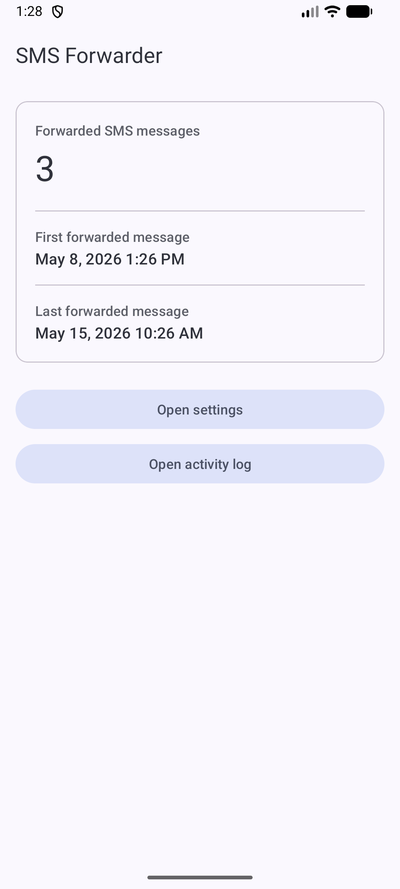
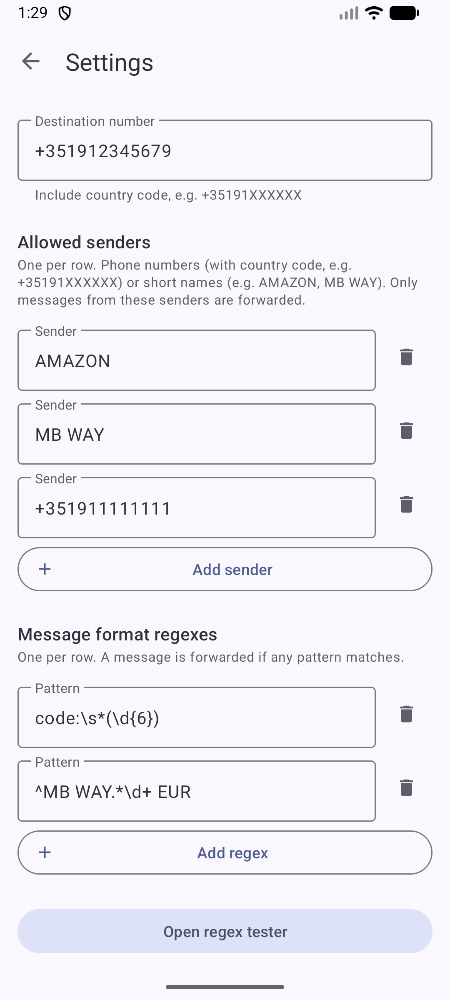
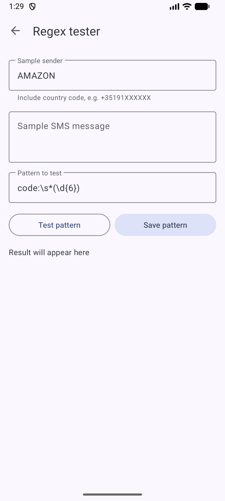
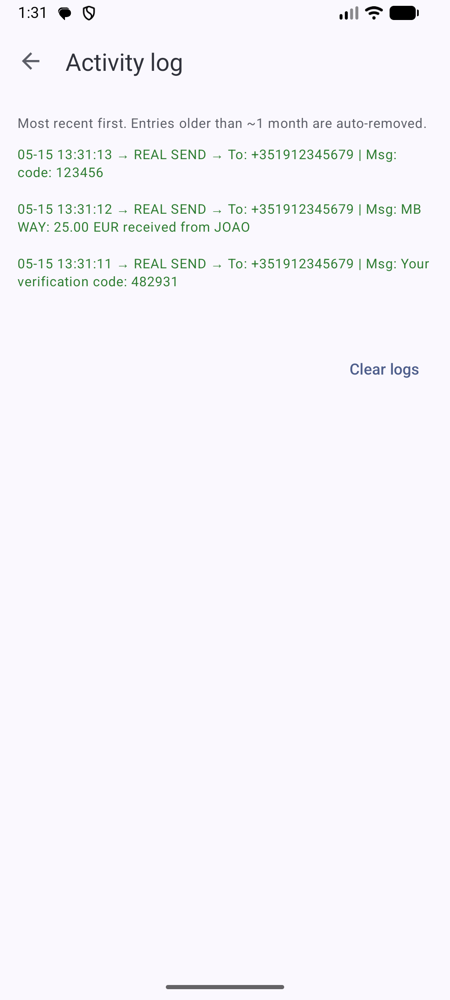

# MC SMS Forwarder

An Android app that forwards selected incoming SMS messages to another phone number. A message is
forwarded when it comes from an allowed sender **and** matches at least one of your configured
regex patterns. Designed for personal use cases like forwarding 2FA codes or bank notifications to
a secondary phone.

## Features

- **Allowed-sender filter** — phone numbers (matched with `PhoneNumberUtils.areSamePhoneNumber`,
  so country-code prefixes and formatting are ignored) or short names like `AMAZON` or `MB WAY`.
- **Regex content filter** — forward only when at least one of your patterns matches the message
  body. Invalid regexes are silently treated as non-matches and never block other patterns.
- **Multipart SMS reassembly** — long, concatenated SMS are reassembled before evaluation and
  re-split for sending via `SmsManager.divideMessage` / `sendMultipartTextMessage`.
- **Regex tester** — try out a pattern against a sample sender and body without sending anything;
  matches are recorded in the activity log as `FAKE SEND` entries.
- **Activity log** — timestamped log of real and simulated sends, persisted across restarts and
  auto-pruned after ~35 days.
- **Forward stats** — main screen shows total forwarded messages, plus the first and last forward
  timestamps. Survives restarts.
- **Material 3 (Material You)** UI with dynamic color, edge-to-edge, and adjust-resize keyboard
  handling.

## Screens

| Main dashboard | Settings |
| :---: | :---: |
|  |  |
| **Regex tester** | **Activity log** |
|  |  |

- **Main** — dashboard with forwarded-message count, first/last forward timestamps, and entry
  points to Settings and Activity log.
- **Settings** — destination phone number, allowed senders, regex patterns, and a shortcut to the
  regex tester. All fields auto-save on every keystroke.
- **Regex tester** — paste a sample sender and message, run a pattern, optionally save the pattern
  to the active set.
- **Activity log** — newest-first list of forward attempts (`REAL SEND` in green, `FAKE SEND` in
  blue) with a Clear logs button.

## Permissions

- `RECEIVE_SMS` — listen for incoming messages.
- `SEND_SMS` — send the forwarded message.
- `POST_NOTIFICATIONS` — required on Android 13+ for any user-facing notifications.
- `REQUEST_IGNORE_BATTERY_OPTIMIZATIONS` — prompted on first launch to keep the broadcast receiver
  reliable.

## Build & run

Requirements:

- Android Studio Ladybug or newer (AGP 8.13, Kotlin 2.0.21).
- JDK 17.
- Android SDK with platform 36.

```powershell
# from the repo root
.\gradlew.bat :app:installDebug

# launch on a connected device or emulator
adb shell am start -n com.miguelcaldas.mcsmsforwarder/.MainActivity
```

`minSdk` is 33, `targetSdk` and `compileSdk` are 36.

## Project layout

```
app/src/main/
├── AndroidManifest.xml
├── java/com/miguelcaldas/mcsmsforwarder/
│   ├── MainActivity.kt          # stats dashboard
│   ├── SettingsActivity.kt      # destination, senders, regex patterns
│   ├── RegexTesterActivity.kt   # try patterns against sample messages
│   ├── LogActivity.kt           # activity log viewer
│   ├── SmsReceiver.kt           # broadcast receiver that filters and forwards
│   └── util/
│       ├── SenderListStore.kt
│       ├── RegexListStore.kt
│       ├── ForwardStatsStore.kt
│       └── LogUtils.kt
└── res/
    ├── drawable/   # vector icons
    ├── layout/     # M3 layouts (CoordinatorLayout + AppBarLayout + NestedScrollView)
    └── values/themes.xml
```

All persistent data is stored in a single `SharedPreferences` file named `mc_sms_forwarder`.

## License

See [LICENSE](LICENSE).
